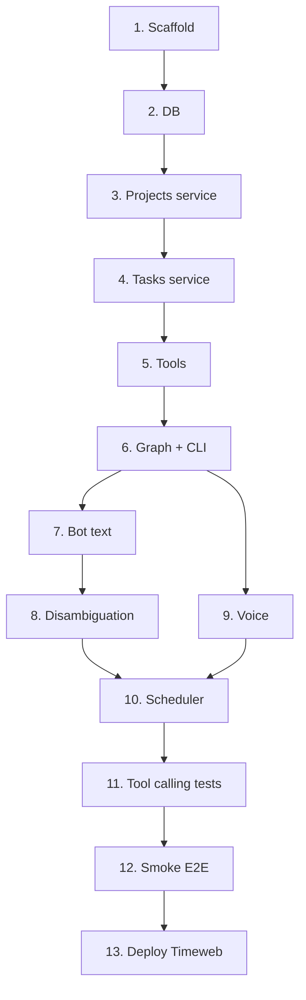

# План: Interior Studio Assistant (срез 1 — MVP)

> Спека: [`docs/specs/interior-studio-assistant.md`](../specs/interior-studio-assistant.md)  
> Статус: **в работе** — задачи 1–11 ✅, 12 ⚠️ (ручной чеклист), 13 ⚠️ (артефакты готовы, VPS — вручную)  
> Следующий шаг: ручная приёмка (задача 12) → деплой на Timeweb (задача 13)

---

## Обзор

13 задач, вертикальные срезы. После каждой — `pytest` зелёный (где применимо).  
Ориентир: ~1 сессия фокуса на задачу.

---

## Задача 1: Scaffold и конфиг

**Описание:** Каркас пакета `interior_studio/`, зависимости, `config.py` с `USER_ALIASES` (Сеня/Рита), `LLM_PROVIDER` (openai/deepseek), `llm.py`, `.env.example`, `data/` в `.gitignore`, пустая структура тестов.

**Критерии приёмки:**
- [x] Пакет импортируется: `python -c "import interior_studio"`
- [x] `config.py`: `ALLOWED_USER_IDS`, `USER_ALIASES`, `DATABASE_URL`, `LLM_PROVIDER`, DeepSeek/OpenAI vars из env
- [x] `llm.py`: `create_chat_llm()` — openai или deepseek по `LLM_PROVIDER`
- [x] Первый id в `TELEGRAM_ALLOWED_USER_IDS` → Сеня, второй → Рита
- [x] `requirements.txt` дополнен: `python-telegram-bot`, `apscheduler`, `sqlalchemy`, `pytest-asyncio`
- [x] `data/studio.db` в `.gitignore`

**Верификация:**
- [x] `pip install -r requirements.txt` без ошибок
- [x] `pytest tests/interior_studio/ -v` — 0 тестов, exit 0

**Зависимости:** нет

**Файлы:**
- `interior_studio/__init__.py`, `config.py`, `llm.py`
- `requirements.txt`, `.env.example`, `.gitignore`
- `tests/interior_studio/conftest.py` (пустой каркас)
- `data/initial_projects.txt` (пример: 3 названия)

---

## Задача 2: Слой БД (SQLAlchemy 2.x)

**Описание:** ORM-модели `User`, `Project`, `Task`, `SentReminder`; engine + session factory; `init_db` создаёт таблицы; `seed_projects` читает файл построчно.

**Критерии приёмки:**
- [x] Модели соответствуют схеме из спеки §5
- [x] `python -m interior_studio.db.init_db` создаёт `data/studio.db`
- [x] `python -m interior_studio.db.seed_projects --file data/initial_projects.txt` — idempotent (повторный запуск не падает)
- [x] In-memory SQLite в `conftest` для тестов

**Верификация:**
- [x] `pytest tests/interior_studio/test_db.py -v`

**Зависимости:** Задача 1

**Файлы:**
- `interior_studio/db/models.py`, `connection.py`, `init_db.py`, `seed_projects.py`
- `tests/interior_studio/test_db.py`, `conftest.py` (fixture `db_session`)

---

## Задача 3: Сервисы проектов и контекст пользователя

**Описание:** `project_service` (list, create, find_by_name_prefix) и `user_context` (get/set active project, upsert user при первом обращении).

**Критерии приёмки:**
- [x] `list_projects(status='active')` возвращает отсортированный список
- [x] `create_project(name)` — unique constraint → понятная ошибка
- [x] `find_matching_projects("Иванов")` → список кандидатов для disambiguation
- [x] `set_active_project(user_id, project_id)` обновляет `users.active_project_id`
- [x] `get_active_project(user_id)` → `{project_id, name}` или `null`

**Верификация:**
- [x] `pytest tests/interior_studio/test_project_service.py -v`

**Зависимости:** Задача 2

**Файлы:**
- `interior_studio/services/project_service.py`, `user_context.py`
- `interior_studio/schemas/project.py`
- `tests/interior_studio/test_project_service.py`

---

## Задача 4: Сервис задач

**Описание:** `task_service` — create (batch), list (фильтры: project, mine_only, status, overdue, week), complete. Pydantic-схемы для входа batch.

**Критерии приёмки:**
- [x] `create_tasks` создаёт N задач за один вызов; `assignee_user_id` и `due_date` опциональны
- [x] `list_tasks(mine_only=True)` — задачи где assignee или created_by = user
- [x] `list_tasks(overdue=True)` — open + due_date < today
- [x] `complete_task` → status=done, `completed_at` заполнен
- [x] Выборка для digest: overdue + today + week (методы для scheduler)

**Верификация:**
- [x] `pytest tests/interior_studio/test_task_service.py -v`

**Зависимости:** Задача 3

**Файлы:**
- `interior_studio/services/task_service.py`
- `interior_studio/schemas/task.py`
- `tests/interior_studio/test_task_service.py`

---

## Задача 5: LangChain tools (обёртки над services)

**Описание:** 7 tools в `agent/tools/`: projects + tasks. Factory `make_tools(session, user_id)` — closure для инъекции контекста. Return `json.dumps(..., ensure_ascii=False)`.

**Критерии приёмки:**
- [x] Все 7 tools из спеки §7 зарегистрированы
- [x] `user_id` не передаётся LLM — подставляется из closure
- [x] Docstring на русском, args на английском (как в `airline_react_agent.py`)

**Верификация:**
- [x] `pytest tests/interior_studio/test_tools_projects.py tests/interior_studio/test_tools_tasks.py -v`

**Зависимости:** Задача 4

**Файлы:**
- `interior_studio/agent/tools/projects.py`, `tasks.py`, `__init__.py`
- `tests/interior_studio/test_tools_projects.py`, `test_tools_tasks.py`

---

## Задача 6: ReAct-граф, промпт и CLI

**Описание:** `graph.py` — `create_studio_agent(tools, system_prompt)` по паттерну `airline_react_agent.py`. LLM через `create_chat_llm()` (`llm.py`). `prompt.py` — полный `STUDIO_SYSTEM_PROMPT` (дата, tools, Сеня/Рита, правила). `cli.py` — `--trace` для локальной отладки.

**Критерии приёмки:**
- [x] Граф: `MessagesState`, `parallel_tool_calls=False`, recursion_limit=10
- [x] Промпт содержит user_id Сеня/Рита и правила batch `create_tasks`
- [x] CLI: `python -m interior_studio.agent.cli --trace "Покажи проекты"` — печатает TAO (при `DEEPSEEK_API_KEY` или `OPENAI_API_KEY` в `.env`)

**Верификация:**
- [x] `pytest tests/interior_studio/test_graph.py -v` (smoke: граф компилируется, mock invoke)
- [x] Ручная: CLI с одной фразой

**Зависимости:** Задача 5

**Файлы:**
- `interior_studio/agent/graph.py`, `prompt.py`, `cli.py`
- `interior_studio/llm.py`
- `tests/interior_studio/test_graph.py`, `test_llm.py`

---

## Задача 7: Telegram-бот — текст и whitelist

**Описание:** `bot/main.py` — Application, long polling. `session.py` — история messages per user (лимит 20). Text handler → agent → ответ. Whitelist: чужие id игнорируются.

**Критерии приёмки:**
- [x] Только `TELEGRAM_ALLOWED_USER_IDS` могут писать боту
- [x] Текстовое сообщение → ответ агента на русском
- [x] История диалога сохраняется в рамках сессии процесса
- [x] При первом сообщении — upsert user в БД

**Верификация:**
- [x] `pytest tests/interior_studio/test_bot_handlers.py -v` (mock Update/Context)
- [ ] Ручная: написать боту «Покажи проекты» в Telegram

**Зависимости:** Задача 6

**Файлы:**
- `interior_studio/bot/main.py`, `session.py`
- `tests/interior_studio/test_bot_handlers.py`

---

## Задача 8: Неоднозначный проект (гибрид C)

**Описание:** Логика disambiguation в bot-слое (до/после агента): при нескольких совпадениях — inline-кнопки для текста, текстовый вопрос для голоса; состояние pending в session (30 мин); приоритет active project.

**Критерии приёмки:**
- [x] Текст + 2 проекта «Ивановы*» → сообщение с inline-кнопками, без `create_tasks` до выбора
- [x] Callback по кнопке → продолжение с выбранным `project_id`
- [x] Голос + неоднозначность → текстовый вопрос (без кнопок)
- [x] Active project среди кандидатов → без вопроса

**Верификация:**
- [x] `pytest tests/interior_studio/test_disambiguation.py -v`
- [ ] Ручная: seed двух «Ивановы» / «Ивановы дача»

**Зависимости:** Задача 7

**Файлы:**
- `interior_studio/bot/disambiguation.py` (или логика в `main.py` + `session.py`)
- `tests/interior_studio/test_disambiguation.py`

---

## Задача 9: Голосовой pipeline (Whisper)

**Описание:** `bot/voice.py` — скачать `voice.ogg`, OpenAI Whisper, передать transcript в агент. Ошибка → «Не разобрал голосовое, напиши текстом».

**Критерии приёмки:**
- [x] Voice handler подключён в `main.py`
- [x] Успешный путь: voice → текст → тот же flow, что и text
- [x] Whisper error / пустой transcript → дружелюбное сообщение
- [x] Флаг `is_voice=True` в session для disambiguation (задача 8)

**Верификация:**
- [x] `pytest tests/interior_studio/test_voice_pipeline.py -v` (mock OpenAI)
- [ ] Ручная: голосовое «По Ивановым заказать плитку»

**Зависимости:** Задача 8

**Файлы:**
- `interior_studio/bot/voice.py`
- `tests/interior_studio/test_voice_pipeline.py`

---

## Задача 10: Scheduler (дайджест + дедлайны)

**Описание:** `scheduler/jobs.py` — `morning_digest`, `deadline_reminder`; `AsyncIOScheduler` стартует в `bot/main.py` (Europe/Moscow, 09:00). Запись в `sent_reminders` против дублей.

**Критерии приёмки:**
- [x] `morning_digest` шлёт каждому user: overdue + today + week
- [x] `deadline_reminder` — задачи с due=tomorrow, один раз per task
- [x] Без assignee → уведомление обоим
- [x] Scheduler живёт в том же процессе, что бот

**Верификация:**
- [x] `pytest tests/interior_studio/test_scheduler.py -v`
- [ ] Ручная: временно cron `* * * * *` или вызов job вручную

**Зависимости:** Задача 7 (нужен bot Application для send_message)

**Файлы:**
- `interior_studio/scheduler/jobs.py`, `__init__.py`
- правки `interior_studio/bot/main.py`
- `tests/interior_studio/test_scheduler.py`

---

## Задача 11: Тесты tool calling (mock LLM)

**Описание:** `test_tool_calling.py` — 11 кейсов из спеки §12; mock LLM возвращает ожидаемые `tool_calls`; проверка, что агент вызывает правильный tool (не текст «я бы создала»).

**Критерии приёмки:**
- [x] Все 11 кейсов проходят на mock
- [x] Кейсы 10–11: disambiguation без tool до выбора
- [x] Опционально `@pytest.mark.live` для 2–3 фраз с реальным OpenAI (документировано в README тестов)

**Верификация:**
- [x] `pytest tests/interior_studio/test_tool_calling.py -v`

**Зависимости:** Задача 6

**Файлы:**
- `tests/interior_studio/test_tool_calling.py`

---

## Задача 12: Smoke и критерии приёмки спеки

**Описание:** Прогон всех тестов; чеклист ручной приёмки; happy path end-to-end в Telegram.

**Критерии приёмки:**
- [x] `pytest tests/interior_studio/ -v` — зелёный (55 passed)
- [ ] Happy path: голос Риты → 3 задачи по Ивановым, assignee Сеня на одной
- [ ] Все пункты §14 спеки отмечены или задокументированы исключения

**Верификация:**
- [x] Полный pytest
- [ ] Ручной чеклист (ниже)

**Зависимости:** Задачи 9, 10, 11

**Файлы:**
- правки по результатам smoke (если нужны)

---

## Задача 13: Деплой на Timeweb Cloud VPS

**Описание:** Артефакты деплоя и выкладка бота на продакшен. Провайдер — Timeweb Cloud, сервис «Облачные серверы», Ubuntu 22.04/24.04. Один systemd unit для `bot/main` + scheduler (спека §13.1).

**Критерии приёмки:**
- [x] `deploy/interior-studio-bot.service` — unit с `Restart=on-failure`, `EnvironmentFile`, непривилегированный `User`
- [x] `deploy/README.md` — пошагово: создание VPS в Timeweb, SSH, venv, `.env`, `init_db`, `seed_projects`, systemd, redeploy, бэкап `studio.db`
- [ ] VPS создан (мин. 1 vCPU / 1 GB RAM); бот отвечает в Telegram с продакшена
- [ ] `systemctl enable` — автозапуск после ребута сервера
- [x] Входящие порты не открыты (long polling, не webhook) — задокументировано в deploy/README

**Верификация:**
- [ ] `systemctl status interior-studio-bot` — active (running)
- [ ] Ручная: написать боту с телефона → ответ
- [ ] Ручная: `sudo reboot` → после загрузки бот снова отвечает
- [ ] `journalctl -u interior-studio-bot -n 50` — без критичных ошибок при старте

**Зависимости:** Задача 12 (smoke E2E пройден локально)

**Файлы:**
- `deploy/interior-studio-bot.service`
- `deploy/README.md`

---

## Чеклист ручной приёмки (задача 12)

| # | Сценарий | OK |
|---|----------|-----|
| 1 | Третий user_id — доступ закрыт | |
| 2 | Текст: «Покажи проекты» | |
| 3 | Текст: «Работаем по X» → active project | |
| 4 | Голос: batch 3 задачи + assignee Сеня | |
| 5 | «Что просрочено?» | |
| 6 | «Плитку заказали» → complete | |
| 7 | Два похожих проекта, текст → кнопки | |
| 8 | Два похожих проекта, голос → вопрос | |
| 9 | Дайджест 09:00 (или ручной trigger) | |
| 10 | Напоминание за день до дедлайна | |

## Чеклист деплоя (задача 13)

| # | Шаг | OK |
|---|-----|-----|
| 1 | VPS Ubuntu в Timeweb Cloud | |
| 2 | SSH, `git clone`, venv, `pip install` | |
| 3 | `.env` на сервере (chmod 600) | |
| 4 | `init_db` + `seed_projects` | |
| 5 | systemd unit установлен и enabled | |
| 6 | Бот отвечает в Telegram | |
| 7 | Рестарт VPS → бот поднялся сам | |

---

## Порядок реализации (кратко)

| # | Задача | ~объём |
|---|--------|--------|
| 1 | Scaffold | 30 мин |
| 2 | DB | 45 мин |
| 3 | Projects service | 45 мин |
| 4 | Tasks service | 60 мин |
| 5 | Tools | 45 мин |
| 6 | Graph + CLI | 60 мин |
| 7 | Bot text | 60 мин |
| 8 | Disambiguation | 90 мин |
| 9 | Voice | 45 мин |
| 10 | Scheduler | 60 мин |
| 11 | Tool calling tests | 60 мин |
| 12 | Smoke E2E | 30 мин |
| 13 | Deploy Timeweb | 60 мин |

**Итого:** ~10–11 часов чистой работы.

---

## Правила при реализации

- Skill: `incremental-implementation` — одна задача за раз, тест после каждой.
- Skill: `langgraph-agent-development` — для задач 5–6.
- Skill: `test-driven-development` — для services (задачи 3–4).
- Не переходить к следующей задаче, пока pytest текущей не зелёный.
