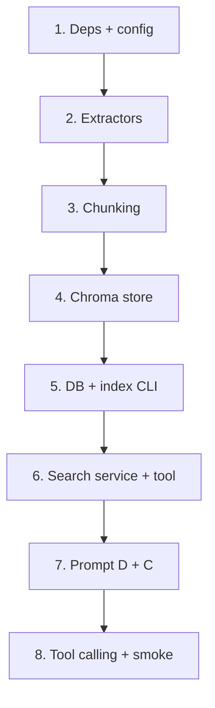

# План: Interior Studio — Project Knowledge (срез 3.0)

> Спека: [`docs/specs/interior-studio-knowledge.md`](../specs/interior-studio-knowledge.md)  
> Идея: [`docs/ideas/interior-studio-knowledge.md`](../ideas/interior-studio-knowledge.md)  
> Зависит от: срез 1 ([`interior-studio-assistant.md`](interior-studio-assistant.md)) — бот, граф, `active_project`  
> Статус: **готов к реализации**  
> Следующий шаг: `incremental-implementation` (задача 1)

---

## Обзор

8 задач, вертикальные срезы. После каждой — `pytest tests/interior_studio/ -v` зелёный.  
Ориентир: ~1 сессия фокуса на задачу.

**Предусловие:** срез 1 работает (`graph`, `make_tools`, CLI, БД проектов/задач).



---

## Задача 1: Зависимости и конфиг knowledge

**Описание:** Добавить `chromadb`, `python-docx`, `pymupdf` в `requirements.txt`; переменные в `config.py` и `.env.example`: `CHROMA_PERSIST_DIR`, `OPENAI_EMBEDDING_MODEL`, `KNOWLEDGE_TOP_K`. Каркас пакета `interior_studio/knowledge/`.

**Критерии приёмки:**
- [ ] `pip install -r requirements.txt` без ошибок
- [ ] `config.py`: чтение `CHROMA_PERSIST_DIR`, `OPENAI_EMBEDDING_MODEL`, `KNOWLEDGE_TOP_K` с дефолтами из спеки
- [ ] `interior_studio/knowledge/__init__.py` существует, пакет импортируется
- [ ] `.env.example` дополнен тремя переменными knowledge
- [ ] `data/chroma/` уже в `.gitignore`

**Верификация:**
- [ ] `python -c "from interior_studio.knowledge import __init__; from interior_studio.config import CHROMA_PERSIST_DIR"`
- [ ] `pytest tests/interior_studio/ -v` — регресс среза 1 зелёный

**Зависимости:** срез 1 завершён

**Файлы:**
- `requirements.txt`, `.env.example`
- `interior_studio/config.py`
- `interior_studio/knowledge/__init__.py`

---

## Задача 2: Извлечение текста (extractors + обход Tier 1)

**Описание:** `extractors.py` — PDF (pymupdf), DOCX (python-docx) → строка. `walk_tier1_files(root)` — обход с фильтрами: только `.pdf`/`.docx`, исключить пути с `Неактуальное`, `старая`; классификация `doc_type` по паттернам из спеки §4.

**Критерии приёмки:**
- [ ] `extract_pdf` / `extract_docx` возвращают непустой текст на фикстурах (маленький sample в `tests/fixtures/knowledge/`)
- [ ] `walk_tier1_files` на mock-дереве не возвращает файлы из `Неактуальное/`
- [ ] `doc_type`: `brief` | `questionnaire` | `site_report` по имени/пути
- [ ] Файлы с &lt; 50 символов текста пропускаются

**Верификация:**
- [ ] `pytest tests/interior_studio/test_knowledge_extract.py -v`

**Зависимости:** Задача 1

**Файлы:**
- `interior_studio/knowledge/extractors.py`
- `tests/interior_studio/test_knowledge_extract.py`
- `tests/fixtures/knowledge/` (минимальные sample pdf/docx или синтетические моки)

---

## Задача 3: Чанкование и metadata

**Описание:** `chunking.py` — разбиение текста на чанки (~500–800 символов или по абзацам/неделям для site_report); metadata: `project_name`, `source_path`, `stage`, `room`, `doc_type`, `chunk_index`. Парсинг `stage`/`room` из относительного пути.

**Критерии приёмки:**
- [ ] Чанки не пустые; `chunk_index` монотонный per file
- [ ] `stage` = первый сегмент пути под корнем проекта
- [ ] `room` заполняется для путей вида `Третий этап/N. Комната/...`
- [ ] `source_path` — относительный путь от корня папки проекта

**Верификация:**
- [ ] `pytest tests/interior_studio/test_knowledge_chunking.py -v`

**Зависимости:** Задача 2

**Файлы:**
- `interior_studio/knowledge/chunking.py`
- `tests/interior_studio/test_knowledge_chunking.py`

---

## Задача 4: ChromaDB store

**Описание:** `store.py` — обёртка: коллекция per `project_name` (или один collection + filter); `upsert_chunks`, `delete_collection`, `search(query, top_k, filters)`. Embeddings через `langchain_openai.OpenAIEmbeddings` с моделью из config.

**Критерии приёмки:**
- [ ] Persistent client в `CHROMA_PERSIST_DIR`
- [ ] `upsert_chunks` + `search` roundtrip на тестовых чанках (mock embeddings или `@pytest.mark.live` с API)
- [ ] Фильтр по `doc_type` / `room` в metadata работает
- [ ] `delete_collection` / reset для `--reset` CLI

**Верификация:**
- [ ] `pytest tests/interior_studio/test_knowledge_store.py -v` (mock embedding для CI без ключа)

**Зависимости:** Задача 3

**Файлы:**
- `interior_studio/knowledge/store.py`
- `tests/interior_studio/test_knowledge_store.py`

---

## Задача 5: БД `project_knowledge_sources` + CLI `index_project`

**Описание:** ORM-модель `ProjectKnowledgeSource`; миграция через `init_schema`. CLI `python -m interior_studio.knowledge.index_project --project --path [--reset]`: обход → extract → chunk → upsert → запись `indexed_at`, `chunk_count`. Связь `project_id` по `projects.name`.

**Критерии приёмки:**
- [ ] Таблица `project_knowledge_sources` в `init_db` / `init_schema`
- [ ] CLI падает с понятной ошибкой, если проект не найден в БД
- [ ] На папке `ЖК Шкиперский/` (локально): `chunk_count > 0` после индексации
- [ ] `--reset` пересоздаёт коллекцию Chroma
- [ ] Seed: проект `ЖК Шкиперский` в `data/initial_projects.txt` или отдельная заметка в README плана

**Верификация:**
- [ ] `pytest tests/interior_studio/test_knowledge_index.py -v` (на tmp-дереве + in-memory DB)
- [ ] Ручная: `index_project` на реальной папке (если есть)

**Зависимости:** Задача 4

**Файлы:**
- `interior_studio/db/models.py` (модель)
- `interior_studio/knowledge/index_project.py`
- `tests/interior_studio/test_knowledge_index.py`
- `data/initial_projects.txt` (добавить «ЖК Шкиперский» при отсутствии)

---

## Задача 6: Search service + tool `search_project_knowledge`

**Описание:** `search.py` — `search_project_knowledge(session, user_id, query, project_id?, room?, doc_type?)`: resolve project (active или по id), Chroma search, JSON-ответ по спеке §5. `agent/tools/knowledge.py` + регистрация в `make_tools`.

**Критерии приёмки:**
- [ ] Без активного проекта и без `project_id` → `{"ok": false, "message": "..."}`
- [ ] Ответ содержит `results[]` с `text`, `source_path`, `doc_type`, `score`
- [ ] Tool зарегистрирован как 8-й tool в `make_tools`
- [ ] `graph` + CLI работают с новым tool без изменения графа

**Верификация:**
- [ ] `pytest tests/interior_studio/test_knowledge_search.py -v`
- [ ] `pytest tests/interior_studio/test_tools_knowledge.py -v`

**Зависимости:** Задача 5

**Файлы:**
- `interior_studio/knowledge/search.py`
- `interior_studio/agent/tools/knowledge.py`
- `interior_studio/agent/tools/__init__.py`
- `tests/interior_studio/test_knowledge_search.py`
- `tests/interior_studio/test_tools_knowledge.py`

---

## Задача 7: Промпт — правила D и формат C

**Описание:** Расширить `build_system_prompt`: когда вызывать `search_project_knowledge` (§7 спеки), формат ответа (§6), пустой RAG, запрет выдумок. Добавить tool в список «Доступные инструменты».

**Критерии приёмки:**
- [ ] Промпт содержит таблицу исключений (list_tasks, complete_task, приветствие — без search)
- [ ] Промпт требует: суть + `Источник:` + цитата ≤200 символов
- [ ] Промпт: при пустом `results` — честный отказ; `create_tasks` только по явной просьбе
- [ ] Существующие `test_graph` / prompt-тесты обновлены при необходимости

**Верификация:**
- [ ] `pytest tests/interior_studio/test_graph.py -v`
- [ ] Ручная: `cli --trace "По Шкиперскому какой цвет дверей?"` после индексации

**Зависимости:** Задача 6

**Файлы:**
- `interior_studio/agent/prompt.py`
- `tests/interior_studio/test_graph.py` (при необходимости)

---

## Задача 8: Tool calling tests + smoke-чеклист

**Описание:** `test_knowledge_tool_calling.py` — mock LLM: ≥9/10 факт-вопросов → `search_project_knowledge` первым; операционные фразы → `list_tasks` / `complete_task` / без search. Документ эталонных 10 вопросов для ручной проверки. Расширить `test_tool_calling.py` при пересечении.

**Критерии приёмки:**
- [ ] `test_knowledge_tool_calling`: ≥9/10 на mock для search-first сценариев
- [ ] `test_knowledge_tool_calling`: ≥9/10 операционка без search
- [ ] `pytest tests/interior_studio/ -v` — полный suite зелёный
- [ ] Чеклист 10 вопросов (спека §10) — файл `docs/checklists/knowledge-shkipersky.md` с колонкой «ожидаемый источник»
- [ ] Ручной smoke: ≥8/10 вопросов с верным источником после `index_project` на Шкиперском

**Верификация:**
- [ ] `pytest tests/interior_studio/test_knowledge_tool_calling.py -v`
- [ ] `pytest tests/interior_studio/ -v`

**Зависимости:** Задача 7

**Файлы:**
- `tests/interior_studio/test_knowledge_tool_calling.py`
- `docs/checklists/knowledge-shkipersky.md`

---

## Порядок и оценка

| Задача | Оценка | Риск |
|--------|--------|------|
| 1. Config | 0.5 сессии | низкий |
| 2. Extractors | 1 сессия | средний (кодировки pdf) |
| 3. Chunking | 0.5 сессии | низкий |
| 4. Chroma store | 1 сессия | средний (mock embeddings) |
| 5. Index CLI | 1 сессия | средний (путь к Шкиперскому) |
| 6. Search + tool | 1 сессия | низкий |
| 7. Prompt | 0.5 сессии | средний (качество LLM) |
| 8. Tests + smoke | 1 сессия | средний |

**Итого:** ~6–7 сессий фокуса.

---

## Не входит в план (срез 3.1+)

- Яндекс.Диск API sync
- `list_project_files` и ссылки
- Cron переиндексации
- OCR / vision
- Изменения Telegram-бота beyond существующего agent invoke (бот уже вызывает тот же граф)

---

## Быстрый старт после задачи 5

```bash
python -m interior_studio.db.init_db
python -m interior_studio.db.seed_projects --file data/initial_projects.txt
python -m interior_studio.knowledge.index_project \
  --project "ЖК Шкиперский" \
  --path "ЖК Шкиперский"
python -m interior_studio.agent.cli --trace "По Шкиперскому какой цвет дверей?"
```

---

## Критерии готовности среза 3.0 (из спеки §12)

- [ ] Все 8 задач — критерии приёмки выполнены
- [ ] CLI index + search в продакшен-процессе задокументированы
- [ ] Ручной чеклист ≥8/10
