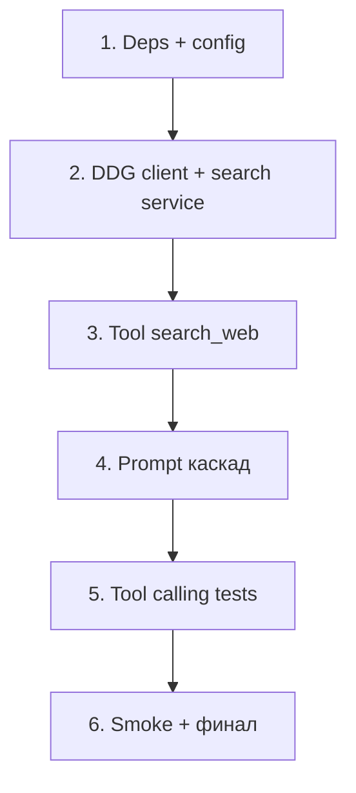

# План: Interior Studio — Web Search (срез 4.0)

> Спека: [`docs/specs/interior-studio-web-search.md`](../specs/interior-studio-web-search.md)  
> Идея: [`docs/ideas/interior-studio-web-search.md`](../ideas/interior-studio-web-search.md)  
> Зависит от: срез 3 ([`interior-studio-knowledge.md`](interior-studio-knowledge.md)) — `search_project_knowledge`, prompt D  
> Статус: **готов к реализации**  
> Следующий шаг: `incremental-implementation` (задача 1)

---

## Обзор

6 задач, вертикальные срезы. После каждой — `pytest tests/interior_studio/ -v` зелёный.  
Ориентир: ~0.5–1 сессия фокуса на задачу.

**Предусловие:** срез 3 работает (`search_project_knowledge`, prompt D, `test_knowledge_tool_calling`).



---

## Задача 1: Зависимости и конфиг web search

**Описание:** Добавить `duckduckgo-search` в `requirements.txt`; переменные в `config.py` и `.env.example`: `WEB_SEARCH_PROVIDER`, `WEB_SEARCH_MAX_RESULTS`, `WEB_SEARCH_REGION`. Каркас пакета `interior_studio/web/`.

**Критерии приёмки:**
- [ ] `pip install -r requirements.txt` без ошибок
- [ ] `config.py`: `WEB_SEARCH_PROVIDER` (default `duckduckgo`), `WEB_SEARCH_MAX_RESULTS` (5), `WEB_SEARCH_REGION` (`ru-ru`)
- [ ] `interior_studio/web/__init__.py` существует, пакет импортируется
- [ ] `.env.example` дополнен тремя переменными web search

**Верификация:**
- [ ] `python -c "from interior_studio.web import __init__; from interior_studio.config import WEB_SEARCH_MAX_RESULTS"`
- [ ] `pytest tests/interior_studio/ -v` — регресс срезов 1–3 зелёный

**Зависимости:** срез 3 завершён

**Файлы:**
- `requirements.txt`, `.env.example`
- `interior_studio/config.py`
- `interior_studio/web/__init__.py`

---

## Задача 2: DuckDuckGo client + search service

**Описание:** `client.py` — протокол/базовый интерфейс `WebSearchClient` + `DuckDuckGoClient` через `duckduckgo-search` (text search). `search.py` — `search_web(query, max_results?)` → JSON по спеке §4–§5; ошибки сети в `{"ok": false, "message": "..."}`, не exception.

**Критерии приёмки:**
- [ ] `DuckDuckGoClient.search()` возвращает список `{title, url, snippet}`
- [ ] Пустой ответ DDG → `{"ok": true, "query": "...", "results": []}`
- [ ] Исключение провайдера перехватывается → `ok: false`
- [ ] `max_results` ограничивается `WEB_SEARCH_MAX_RESULTS` из config
- [ ] `region` передаётся из `WEB_SEARCH_REGION`

**Верификация:**
- [ ] `pytest tests/interior_studio/test_web_search.py -v` (mock `DuckDuckGoClient`, без интернета в CI)

**Зависимости:** Задача 1

**Файлы:**
- `interior_studio/web/client.py`
- `interior_studio/web/search.py`
- `tests/interior_studio/test_web_search.py`

---

## Задача 3: Tool `search_web` + регистрация в агенте

**Описание:** `agent/tools/web_search.py` — Pydantic schema, `SEARCH_WEB_SCHEMA`, `search_web_impl` (тонкая обёртка над `interior_studio.web.search`). Регистрация в `make_tools` после `search_project_knowledge`. Граф **не** менять.

**Критерии приёмки:**
- [ ] Tool `search_web` с args: `query` (required), `max_results` (optional)
- [ ] Description для LLM соответствует спеке §4
- [ ] Tool зарегистрирован как 9-й tool в `make_tools`
- [ ] CLI / graph invoke не падают при наличии нового tool (mock client в тестах)

**Верификация:**
- [ ] `pytest tests/interior_studio/test_tools_web_search.py -v`
- [ ] `pytest tests/interior_studio/test_graph.py -v` (регресс)

**Зависимости:** Задача 2

**Файлы:**
- `interior_studio/agent/tools/web_search.py`
- `interior_studio/agent/tools/__init__.py`
- `tests/interior_studio/test_tools_web_search.py`

---

## Задача 4: Промпт — каскад knowledge → web

**Описание:** Расширить `build_system_prompt`: добавить `search_web` в список инструментов; секция «Поиск в интернете» (спека §7): явные триггеры, узкий список внешних тем, каскад после пустого knowledge, запрет web при create_tasks и внутренних фактах; формат ответа §6 (суть + URL + цитата).

**Критерии приёмки:**
- [ ] Промпт содержит триггеры: «найди в интернете», «загугли», «поищи в сети»
- [ ] Промпт: knowledge **до** web (кроме явной просьбы про интернет)
- [ ] Промпт: пустой RAG + внешняя тема → `search_web`; + внутренняя → отказ без web
- [ ] Промпт: «создай задачу узнать…» → только `create_tasks`
- [ ] Промпт: формат ответа с `Источник: {url}`

**Верификация:**
- [ ] `pytest tests/interior_studio/test_graph.py -v`
- [ ] Unit-тест на фрагменты prompt (опционально: `test_prompt_web_rules.py` или assert в `test_web_tool_calling`)

**Зависимости:** Задача 3

**Файлы:**
- `interior_studio/agent/prompt.py`

---

## Задача 5: Tool calling tests (mock LLM)

**Описание:** `test_web_tool_calling.py` — паттерн `test_knowledge_tool_calling.py`: mock LLM + mock web/knowledge stores. Покрыть сценарии из спеки §10.

**Критерии приёмки:**
- [ ] Явный web: «Найди в интернете …» → первый tool `search_web`
- [ ] Каскад: «Какой интернет в ЖК …?» → первый `search_project_knowledge`; mock второго шага LLM → `search_web`
- [ ] Negative: «Какой цвет дверей?» + empty RAG → только knowledge, **без** search_web в цепочке
- [ ] «Создай задачу узнать интернет…» → `create_tasks`
- [ ] «Мои задачи» → `list_tasks`, без search_web
- [ ] ≥5 parametrized сценариев, все зелёные

**Верификация:**
- [ ] `pytest tests/interior_studio/test_web_tool_calling.py -v`

**Зависимости:** Задача 4

**Файлы:**
- `tests/interior_studio/test_web_tool_calling.py`

---

## Задача 6: Smoke-чеклист + финальная верификация

**Описание:** Чеклист ручных сценариев для smoke с реальным DDG. Обновить `tests/interior_studio/README.md` (если есть) или создать `docs/checklists/web-search-smoke.md`. Прогнать полный test suite.

**Критерии приёмки:**
- [ ] `pytest tests/interior_studio/ -v` — полный suite зелёный
- [ ] Чеклист smoke (минимум 4 сценария из спеки §8) задокументирован
- [ ] Ручной smoke (с интернетом): «интернет в ЖК» и «найди в интернете …» — ответ содержит URL
- [ ] Спека §12: все пункты критериев приёмки отмечены

**Верификация:**
- [ ] `pytest tests/interior_studio/ -v`
- [ ] Ручная: `python -m interior_studio.agent.cli --trace "Какой интернет есть в ЖК Шкиперский?"`
- [ ] Ручная: `python -m interior_studio.agent.cli --trace "Найди в интернете аналоги плитки Kerama Marazzi 60x60"`

**Зависимости:** Задача 5

**Файлы:**
- `docs/checklists/web-search-smoke.md`
- `tests/interior_studio/README.md` (при наличии — дополнить)

---

## Порядок и оценка

| Задача | Оценка | Риск |
|--------|--------|------|
| 1. Config | 0.25 сессии | низкий |
| 2. Client + service | 0.5–1 сессия | средний (нестабильность DDG API) |
| 3. Tool | 0.5 сессии | низкий |
| 4. Prompt | 0.5 сессии | средний (compliance DeepSeek) |
| 5. Tool calling tests | 0.5–1 сессия | средний (mock двухшагового каскада) |
| 6. Smoke + финал | 0.5 сессии | средний (DDG блокировки / rate) |

**Итого:** ~3–4 сессии фокуса.

---

## Не входит в план (срез 4.1+)

- Tavily / SerpAPI провайдер
- Dynamic bind tool (только при триггере)
- Кэш web-результатов
- Запись результатов в задачу / Chroma
- Rate limit
- Изменения Telegram-бота beyond существующего agent invoke

---

## Быстрый старт после задачи 3

```bash
pytest tests/interior_studio/test_web_search.py tests/interior_studio/test_tools_web_search.py -v

# Smoke (нужен интернет, после задачи 4)
python -m interior_studio.agent.cli --trace "Найди в интернете провайдеров интернета ЖК Шкиперский"
```

---

## Критерии готовности среза 4.0 (из спеки §12)

- [ ] Все 6 задач — критерии приёмки выполнены
- [ ] `search_web` в графе; prompt с правилами каскада
- [ ] CI-тесты без интернета (mock client)
- [ ] Ручной smoke: 2 запроса с URL в ответе

---

## Риски и митигация

| Риск | Митигация |
|------|-----------|
| DDG блокирует IP / нестабилен | Ошибка в JSON; smoke в чеклисте; абстракция client для Tavily (4.1) |
| DeepSeek вызывает web без просьбы | Prompt + negative tests; при регрессии — dynamic bind (4.x) |
| DeepSeek не делает второй шаг каскада | Tool calling test с двумя mock invoke; усилить prompt примером каскада |
